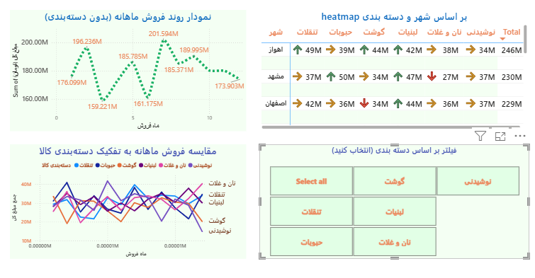

# 📊 Power BI Sales Dashboard

This is an interactive sales dashboard built in Power BI.

## 📌 Features

- Total Sales & Transaction Count
- Sales by City
- Sales by Category
- Monthly Sales Trends
- Heatmap by City & Category
- Interactive slicer by Product Category

- ## 🖼️ Screenshots

- ## ✅ صفحه اول:

- 💳 **کارت جمع مبلغ کل فروش**
- 🔢 **کارت تعداد تراکنش‌ها**
- 📍 **نمودار میله‌ای فروش به تفکیک شهر**
- 📦 **نمودار ستونی فروش به تفکیک دسته‌بندی کالا**
- 📅 **نمودار ستونی فروش به تفکیک ماه**
 - 🎛️ **اسلایسر تعاملی بر اساس ماه**

### 📄 Dashboard – Page 1

## ✅ صفحه دوم:

- 📈 **نمودار روند فروش ماهانه (Line Chart)**
- 📈 **نمودار روند فروش ماهانه به تفکیک دسته‌بندی**
  - 🔥 **Heatmap فروش بر اساس شهر و دسته‌بندی (Matrix)**
- 🎛️ **اسلایسر تعاملی بر اساس دسته‌بندی کالا**

### 📄 Dashboard – Page 2

## 🎯 نکات فنی:

- داده‌ها به صورت **Table Format** آماده‌سازی شده‌اند.
- در ویژوال‌ها از قابلیت **interactive filtering** استفاده شده.
- طراحی صفحات با در نظر گرفتن **وضوح، سادگی و جذابیت بصری** انجام شده.
- از ابزارهایی مانند **Sort، Data Labels، Display Units** و **Custom Colors** استفاده شده است.

